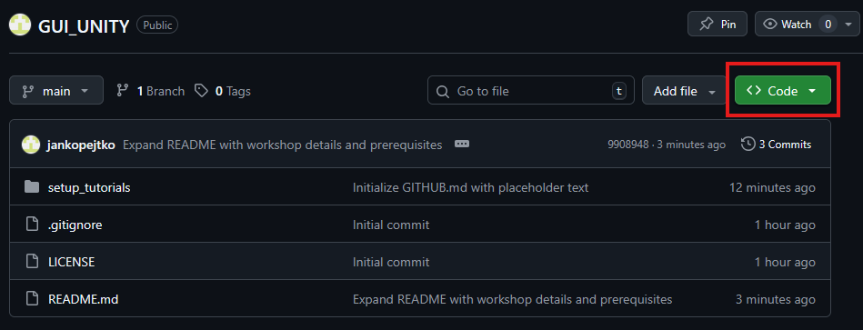
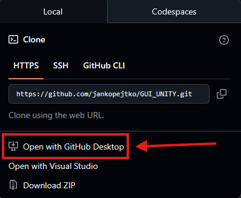
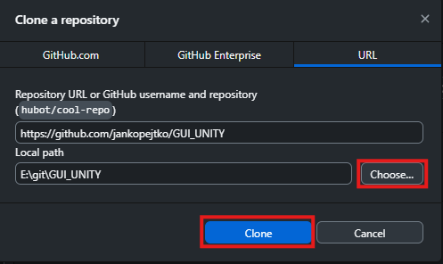

## How to Download (Clone) the Repository via GitHub Desktop

To work with the project on your computer, the easiest way is to download it using the GitHub Desktop application. Here is a step-by-step guide:

**Prerequisite:** Make sure you have the [GitHub Desktop](https://desktop.github.com/download/) application installed.

### Step 1: Open the Code Menu
On the main page of this repository, click the green **`<> Code`** button in the top right corner.

### Step 2: Open in GitHub Desktop
From the dropdown menu, select the **`Open with GitHub Desktop`** option. Your browser might ask if you want to allow the application to open – confirm it.

### Step 3: Cloning to Your PC
The GitHub Desktop application will open with a "Clone a repository" window. 
1. In the **Local path** section, click the **`Choose...`** button and select a folder on your drive where you want to save the project (e.g., `C:\UnityProjects\GUI_UNITY`).
2. Then click the blue **`Clone`** button.

And that's it! Now you have the entire project downloaded to your computer and you can open it in Unity Hub.

### UNITY HUB TUTORIAL ###
[Continue --->](UNITYHUB_ENG.md)
