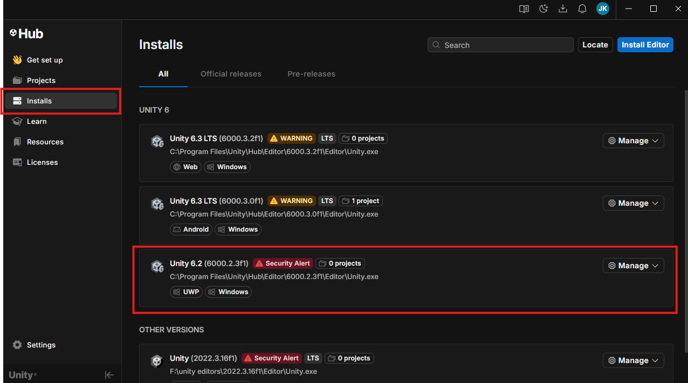
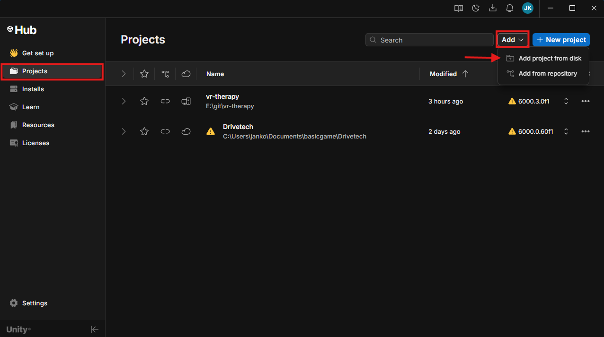
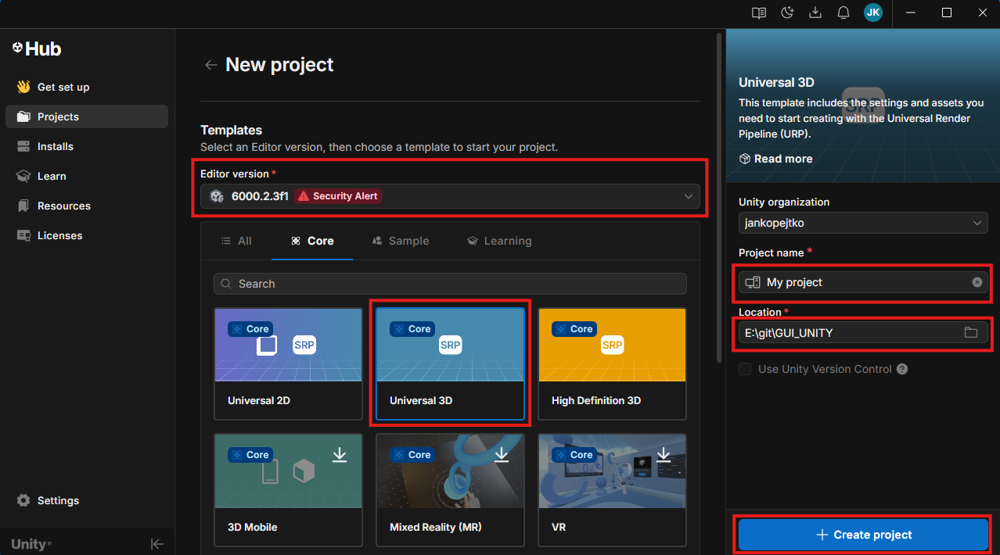

### How to Open (or Create) a Project in Unity Hub ###

Once you have the project downloaded to your computer, you need to link it with Unity Hub.

### Step 1: Check Unity Version
Go to the **Installs** tab in the left menu. Check if you have the required Unity version installed (in our case `6000.2.3f1`).

### Step 2: Add Downloaded Project from Disk
If you are opening a project downloaded from this GitHub repository, go to the **Projects** tab on the left. In the top right corner, click the small arrow next to the `Add` button and select **Add project from disk**. Then simply find and select the folder you downloaded from GitHub.

### Alternative: Create a Completely New Project
If you are not opening our pre-made project but want to start with a clean slate, click the blue **+ New project** button. 
1. Make sure you have the correct version selected in **Editor version**.
2. Select the **Universal 3D** template (or another 3D template).
3. Fill in the **Project name** and **Location** (where the folder should be saved).
4. Click the blue **Create project** button and wait for the Editor to load.

